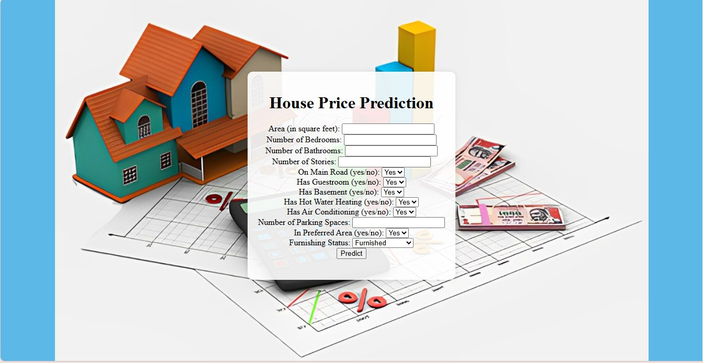

# House Price Predictor

A Flask web application that predicts house prices based on various input features using a machine learning model.



## Live Hosted Link:
    '''bash
    https://house-price-predictor-web-app.onrender.com/
    '''

## Features

- Predict house prices based on input features such as number of bedrooms, square footage, location, etc.
- User-friendly interface for inputting data and viewing predictions.
- Integrated with a pre-trained machine learning model for accurate predictions.

## Demo

You can view a live demo of the application [here](#).

## Installation

To run the application locally, follow these steps:

1. **Clone the repository:**

    ```bash
    git clone https://github.com/yourusername/house-price-predictor.git
    cd house-price-predictor
    ```

2. **Create and activate a virtual environment:**

    ```bash
    python -m venv venv
    source venv/bin/activate  # On Windows use `venv\Scripts\activate`
    ```

3. **Install the required dependencies:**

    ```bash
    pip install -r requirements.txt
    ```

4. **Run the application:**

    ```bash
    python app.py
    ```

5. **Open your browser and go to** `http://127.0.0.1:5000/` **to view the application.**

## Usage

- Input the features of the house you want to predict the price for.
- Click the "Predict" button to see the predicted price.

## Technologies Used

- **Flask**: Web framework for building the application.
- **Python**: Programming language used.
- **scikit-learn**: For building and training the machine learning model.
- **pandas**: For data manipulation and analysis.
- **numpy**: For numerical operations.
- **pickle**: For loading trained ML Model.

## Contributing

Contributions are welcome! Please follow these steps to contribute:

1. Fork the repository.
2. Create a new branch (`git checkout -b feature-branch`).
3. Make your changes and commit (`git commit -am 'Add new feature'`).
4. Push to the branch (`git push origin feature-branch`).
5. Create a new Pull Request.

## License

This project is licensed under the MIT License - see the [LICENSE](LICENSE) file for details.


--

